# Parcours utilisateur, du geste au code

Ce que fait l'opérateur, et ce que le code exécute à chaque étape. Trois
parcours, ceux du cahier des charges.

!!! warning "Les numéros de ligne vieillissent"

    Ils correspondent au commit **e985659**. Un ajout de dix
    lignes en haut d'un fichier les décale tous sans que rien ne le signale.
    Les noms de fonctions, eux, restent justes : en cas de doute, cherchez le
    nom plutôt que la ligne.

---

## Parcours connexion

### Créer un compte

| # | Ce que fait l'utilisateur | Code |
|---|---|---|
| 1 | L'application démarre sur l'écran de connexion, aucune session ouverte | `MyApp` - `MainActivity.kt:119` ; route `AUTH` - `Destinations.kt:6` |
| 2 | Il touche « Créer un compte » en bas de l'écran | `toggleMode()` - `AuthViewModel.kt:33`. Un champ Nom apparaît |
| 3 | Il saisit nom, adresse e-mail, mot de passe | `onDisplayNameChange` :30, `onEmailChange` :24, `onPasswordChange` :27. Chaque frappe efface l'erreur du champ concerné |
| 4 | Il touche « Créer le compte » | `submit()` - `AuthViewModel.kt:44` |
| 5 | La validation locale s'exécute d'abord | Toujours dans `submit()` : e-mail vide ou sans `@`, mot de passe sous six caractères, nom vide. **Aucun appel réseau si un champ est fautif** |
| 6 | L'appel part vers Firebase | `signUp` - `UserRepositoryImpl.kt:36` : création du compte, `updateProfile` pour le nom, puis `reload` pour que l'instance locale le reflète |
| 7 | En cas d'échec | `messageFor` :99 traduit « already in use » en message lisible. Les libellés bruts de Firebase sont en anglais et parlent de « credential » |
| 8 | En cas de succès | Rien n'est fait ici : `currentUser` change, et `SessionRedirect` (`StockNavGraph.kt:39`) redirige |

L'écran est découpé en deux : `AuthScreen` (`AuthScreen.kt:36`) connaît le
ViewModel, `AuthContent` (:54) ne reçoit que des données et des lambdas - c'est
ce qui le rend prévisualisable et testable sans Hilt.
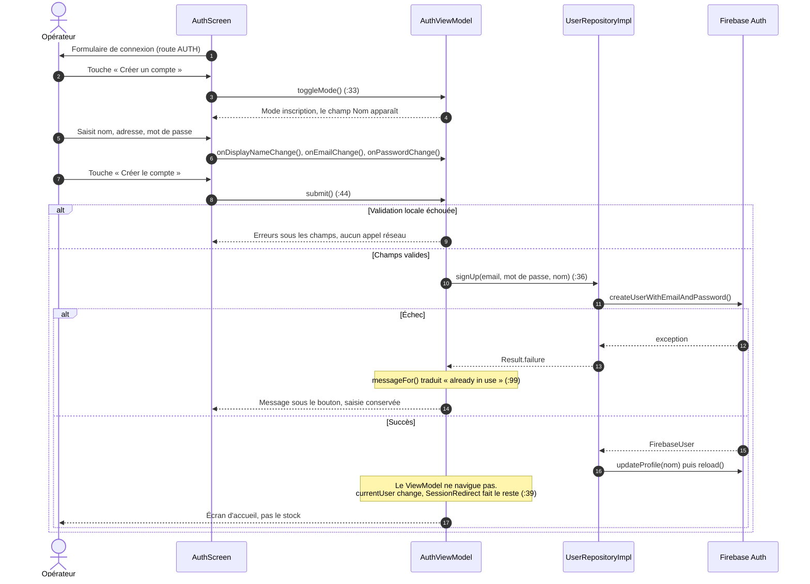

### S'identifier

Même chemin, deux différences : `submit()` appelle `signIn`
(`UserRepositoryImpl.kt:31`), et le nom n'est pas demandé.

Après succès, l'opérateur arrive sur l'**écran d'accueil** -
`composable(WELCOME)` (`StockNavGraph.kt:89`), `WelcomeScreen`
(`WelcomeScreen.kt:62`) - qui nomme explicitement la session ouverte. C'est le
garde-fou demandé pour les téléphones partagés.

Il touche « OK, c'est bien moi » (:122) → `acknowledgeWelcome()`
(`MainViewModel.kt:116`), et l'effet de navigation l'envoie sur la liste des
emplacements.
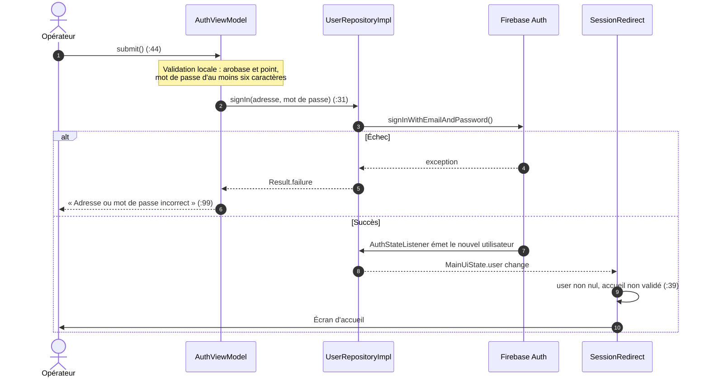

### Se déconnecter

Deux points d'entrée :

- depuis l'accueil, le bouton « Se déconnecter » - `WelcomeScreen.kt:126` ;
- depuis n'importe quel écran de stock, l'icône de la barre supérieure
  `SignOutIcon` (`AppBars.kt:175`).

Les deux appellent `signOut()` (`MainViewModel.kt:120`), qui remet l'accueil à
« non validé » **puis** délègue à `signOut` (`UserRepositoryImpl.kt:54`). Sans
cette remise à zéro, l'opérateur suivant sauterait l'avertissement.

`currentUser` passe à `null`, et deux mécanismes se déclenchent :

- `SessionRedirect` renvoie sur `AUTH` **en vidant la pile** - le
  bouton retour ne doit pas ramener sur les écrans de stock ;
- `whileSignedIn` (`ui/SessionGate.kt`) annule les écouteurs Firestore. Sans
  lui, ils recevraient un refus de permission et l'application se fermerait.
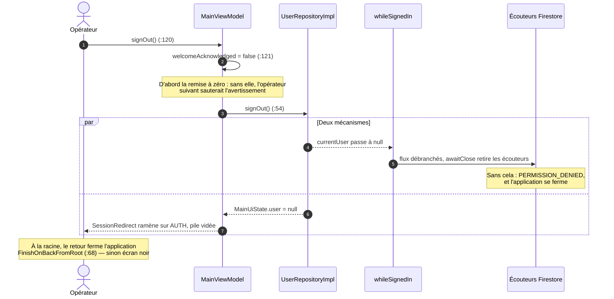

### Supprimer le compte

| # | Ce que fait l'utilisateur | Code |
|---|---|---|
| 1 | Il touche « Supprimer mon compte », en rouge et à l'écart des deux actions courantes | `WelcomeScreen.kt:131` |
| 2 | Une fenêtre s'ouvre. Elle avertit que **l'historique restera signé de son adresse**, et demande le mot de passe | `DeleteAccountDialog` :154 |
| 3 | Il valide | :194 → `deleteAccount(password)` - `MainViewModel.kt:83` |
| 4 | Ré-authentification, puis suppression | `UserRepositoryImpl.kt:61`. Firebase refuse `delete()` sans connexion récente : le mot de passe lève la contrainte et sert de confirmation |
| 5 | Mot de passe faux | L'erreur s'affiche sous le champ (:182) et la fenêtre reste ouverte : la saisie n'est pas perdue |
| 6 | Succès | La session se ferme, le même effet de navigation ramène sur `AUTH` |

L'avertissement est affiché **avant** la validation, pas après. Voir la
[question ouverte](taches.md#rgpd) sur le sort de cette donnée personnelle.
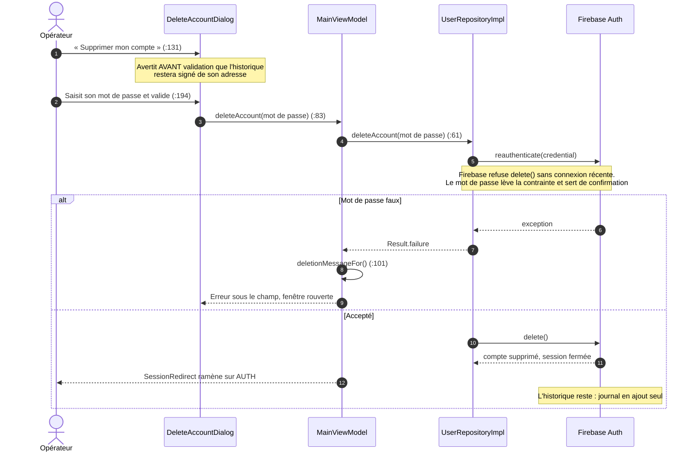

---

## Parcours emplacements de stockage

### Créer un emplacement

1. Sur la liste, il touche le bouton flottant - `StockFab` (`AppBars.kt:143`). La route
   courante décide de l'action : `AISLE_LIST` déclenche
   `showAddAisleDialog = true` (`MainActivity.kt:180`).
2. La fenêtre s'affiche - appel via `AddAisleDialogHost`, définition `AddAisleDialog.kt:19`. Le
   bouton « Créer » reste inactif tant que le nom est vide.
3. Il valide : `onConfirm(name)` (:45) → `addAisle` (`AisleViewModel.kt:53`) →
   `addAisle` (`AisleRepositoryImpl.kt:62`).
4. La liste se met à jour seule : `observeAisles` (:29) est un flux, et
   `uiState` (`AisleViewModel.kt:35`) réémet.

Un nom déjà pris est refusé à la casse et aux espaces près, et le message
s'affiche **sous le champ, fenêtre ouverte** : deux emplacements homonymes
seraient indiscernables dans la liste déroulante du formulaire de médicament.

Cet écran remplace l'ancien bouton qui fabriquait « Aisle 2 », « Aisle 3 » : un
emplacement porte un nom choisi.
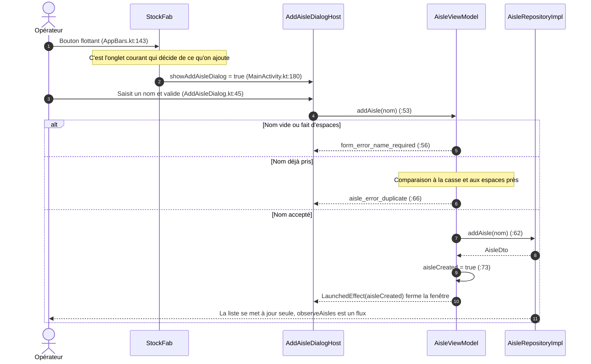

La fenêtre se ferme **au succès, jamais au clic** : sinon un nom refusé
disparaîtrait avec son message avant d'avoir été lu.

### Ouvrir un emplacement

`AisleItem` (`AisleScreen.kt:94`) remonte le clic à :85, qui appelle
`Destinations.aisleDetail(id)` (:22) - la route `aisle/{aisleId}` - et le
NavHost sélectionne `composable(AISLE_DETAIL)` (`StockNavGraph.kt:127`).

`AisleDetailScreen` (`AisleDetailScreen.kt:23`) n'a **aucune composable
propre** : il réutilise `MedicineContent` (:33). Même ligne, même mise en page,
seul le contenu change.

Le contenu, justement, ne vient pas de la liste principale. L'écran ouvre son
propre flux - `observeMedicinesInAisle` (`MedicineViewModel.kt:67`) →
`MedicineRepositoryImpl.kt:68` - dont le filtre `whereEqualTo("aisleId", …)`
est **exécuté par la base**. Auparavant tout le stock descendait pour n'afficher
qu'une poignée de lignes.
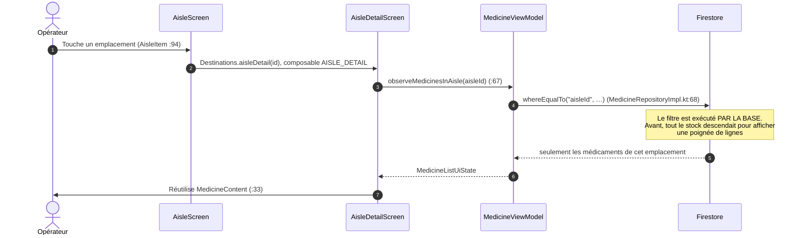

### Ouvrir un médicament depuis un emplacement

C'est la même composable que la liste principale : `MedicineContent`
(`MedicineScreen.kt:37`), clic à :61 → `Destinations.medicineDetail(id)` (:24)
→ `composable(MEDICINE_DETAIL)` (`StockNavGraph.kt:142`).

---

## Parcours médicaments

### Créer un médicament

| # | Ce que fait l'utilisateur | Code |
|---|---|---|
| 1 | Il touche le bouton flottant depuis la liste des médicaments | `StockFab` (`AppBars.kt:143`) → route `MEDICINE_NEW`, déclarée **avant** `medicine/{id}` (`StockNavGraph.kt:136` contre :142) sans quoi « new » serait pris pour un identifiant |
| 2 | Il saisit le nom | `onNameChange` - `MedicineFormViewModel.kt:74` |
| 3 | Il choisit l'emplacement dans une liste déroulante | `MedicineFormScreen.kt:107` → `onAisleChange` :80. **On choisit parmi ce qui existe, on ne saisit pas librement** |
| 4 | Il saisit la quantité initiale | `onStockChange` :77 - les caractères non numériques sont filtrés à la frappe |
| 5 | Il touche « Créer le médicament » | `MedicineFormScreen.kt:143` → `submit()` :83 : validation des trois champs, puis `addMedicine` - `MedicineRepositoryImpl.kt:116` |
| 6 | Le médicament et sa trace de création partent dans **le même lot** | Toujours :116. Aucun des deux ne peut exister sans l'autre |
| 7 | Retour automatique à la liste | `LaunchedEffect(state.isSaved)` - `MedicineFormScreen.kt:46` |
| 8 | Si l'enregistrement échoue | Le message s'affiche **sous le bouton** et la saisie est conservée : un message éphémère disparaîtrait pendant que l'opérateur retape |

Cet écran remplace le bouton « + » qui ajoutait un médicament au nom et au stock
aléatoires, dans un emplacement tiré au hasard.
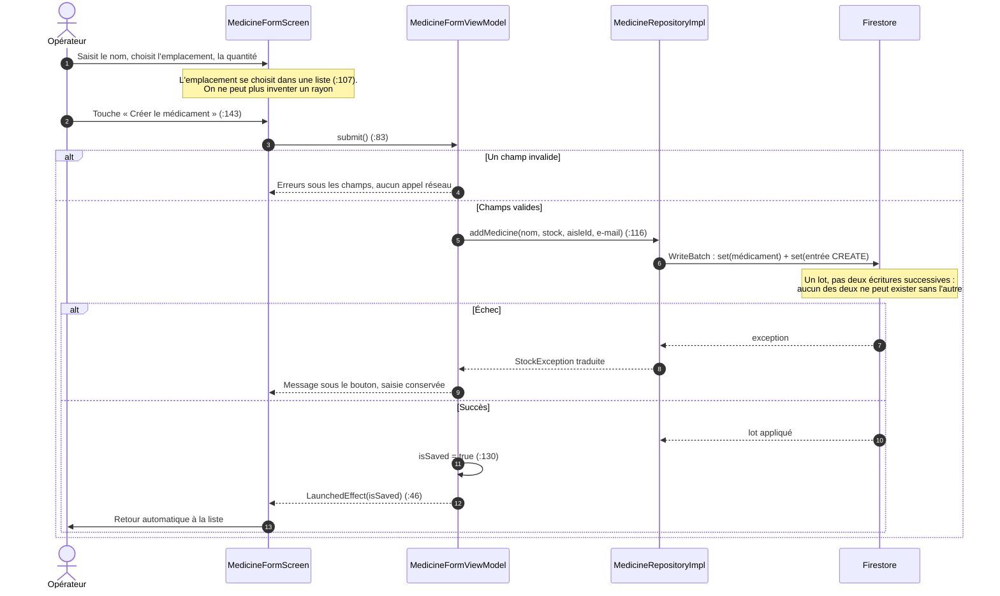

### Ouvrir un médicament

`MedicineDetailScreen` (`MedicineDetailScreen.kt:59`) appelle `observeDetail`
(`MedicineViewModel.kt:111`), qui combine trois sources : le médicament
(`MedicineRepositoryImpl.kt:85`), son historique (:96), et les libellés
d'emplacement - le document ne porte qu'un identifiant de rayon, le libellé se
résout dans le ViewModel.

L'historique est lu **par pages** : vingt entrées, pas les centaines qu'accumule
un médicament très manipulé. Une entrée de plus est demandée sans jamais être
affichée - c'est elle qui dit à l'écran qu'une page plus ancienne existe
(`detail` — `MedicineViewModel.kt:123`). Le bouton « Voir les entrées plus anciennes »
(`MedicineDetailScreen.kt:268`) appelle `showMoreHistory()`
(`MedicineViewModel.kt:139`), qui élargit la fenêtre sans reconstruire le flux :
la fiche ne repasse pas par son indicateur de chargement.

L'affichage se fait par `MedicineDetailContent` (:150), les trois valeurs en
lecture par `ReadOnlyField` (:280), l'historique par `HistoryItem` (:327).

L'historique remonte en tête à chaque nouvelle entrée (:161) : sans cela, un
opérateur qui a fait défiler la liste ne verrait pas le mouvement qu'il vient de
faire.
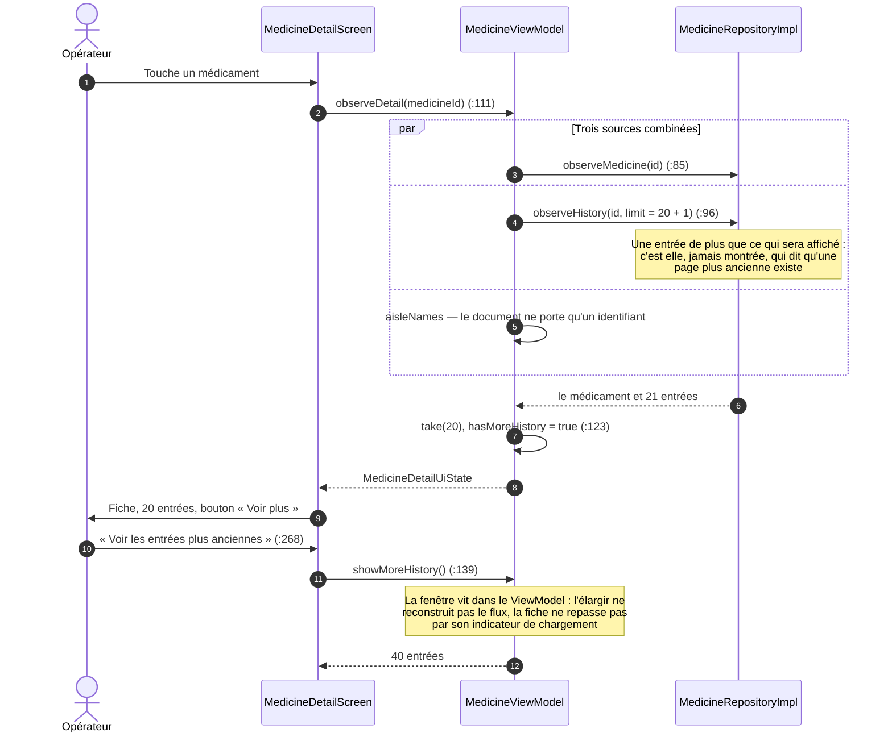

### Diminuer la quantité

| # | Ce que fait l'utilisateur | Code |
|---|---|---|
| 1 | Il saisit une quantité | Le champ est vide au départ, ce qui laisse les deux boutons **inactifs** : un doigt qui traîne ne peut pas produire un mouvement |
| 2 | Il touche « Retirer » | `MedicineDetailScreen.kt:213` → :111 → `updateStock` - `MedicineViewModel.kt:155` |
| 3 | Une transaction s'exécute | `MedicineRepositoryImpl.kt:204` : relecture du stock réel, refus si le retrait le dépasse, sinon écriture **du stock et de sa trace ensemble** |
| 4 | Si le mouvement est accepté | Confirmation par `LaunchedEffect(confirmation)` (:79). Le champ n'est vidé **qu'ici**, une fois l'écriture faite |
| 5 | Si le retrait dépasse le stock | Fenêtre à valider - `ActionErrorHost` (`MainActivity.kt:213`) - indiquant la quantité disponible. La saisie est conservée |

Deux points qui se voient mal dans le code mais comptent à l'usage :

**Le contrôle est dans la transaction, pas dans l'écran.** C'est le seul endroit
qui lit le stock réel au moment de l'écriture ; un contrôle sur la valeur
affichée travaillerait sur un chiffre peut-être périmé.

**Un mouvement de cinquante unités produit une seule entrée d'historique.** Le
service qualité cherchant « qui a retiré 50 boîtes » ne trouve pas cinquante
lignes de « -1 ».
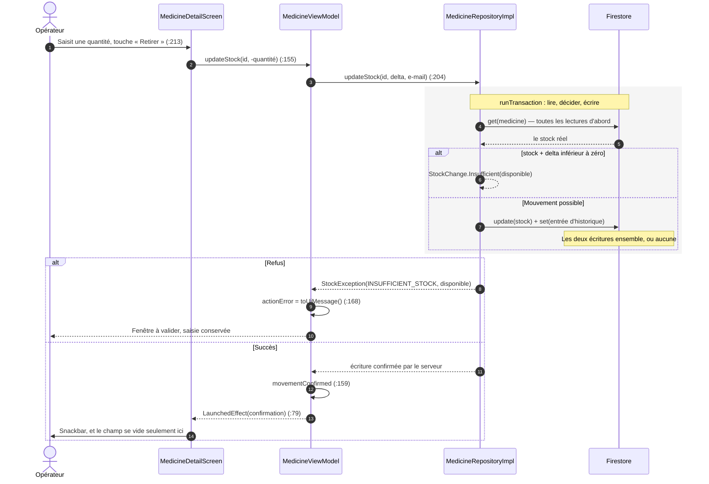

### Corriger une fiche

« Modifier ce médicament » (`MedicineDetailScreen.kt:236`) ouvre
`composable(MEDICINE_EDIT)` (`StockNavGraph.kt:152`) - le même formulaire que la
création, qui lit son identifiant dans son `SavedStateHandle`.

`updateMedicine` (`MedicineRepositoryImpl.kt:157`) corrige le nom et
l'emplacement, jamais le stock : celui-ci ne bouge que par un mouvement tracé.
La correction produit sa propre entrée d'historique, avec un stock avant et
après identiques.
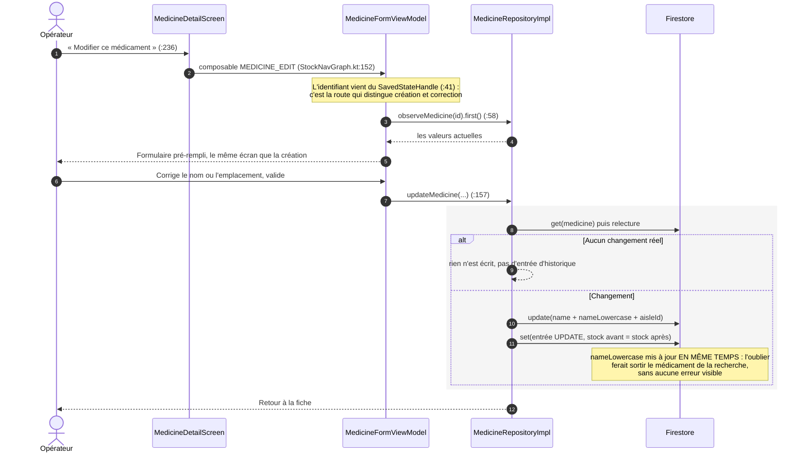

Le stock n'est **jamais** modifiable ici : il ne bouge que par un mouvement
tracé. Corriger un stock par ce chemin contournerait la traçabilité.

### Supprimer un médicament

1. Il touche « Supprimer ce médicament » - `MedicineDetailScreen.kt:239`.
2. `DeleteMedicineDialog` (:296) rappelle **en rouge le nombre d'unités
   restantes** si le stock n'est pas nul. La décision se prend en connaissance
   de cause.
3. Il valide → :113 → `deleteMedicine` (`MedicineViewModel.kt:172`) →
   `MedicineRepositoryImpl.kt:249` : suppression et trace dans la même
   transaction. **L'historique survit au médicament supprimé** - c'est
   l'opération que le service qualité a le plus besoin de retrouver.
4. `onDeleted` renvoie à la liste par `navigateUp`.
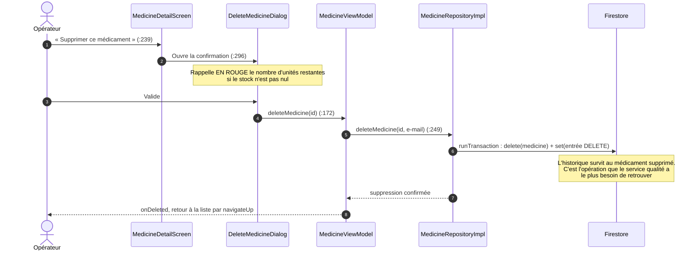

---

## Ce que ces parcours ont en commun

Trois traits reviennent dans les trois parcours, et ce sont des choix, pas des
hasards :

**Les écrans ne décident de rien.** Ils affichent un état et remontent des
gestes. Toute la logique est dans les ViewModels et les dépôts - c'est ce qui
permet de tester ces parcours sans émulateur.

**Les écritures sensibles passent par une transaction**, avec leur trace dans la
même opération. Un stock modifié sans trace serait exactement l'incohérence
signalée par le service qualité.

**Un refus se valide, une réussite s'annonce.** Les échecs ouvrent une fenêtre
qu'il faut acquitter ; les confirmations passent par un message éphémère. Voir
les [décisions d'architecture](decisions.md).
