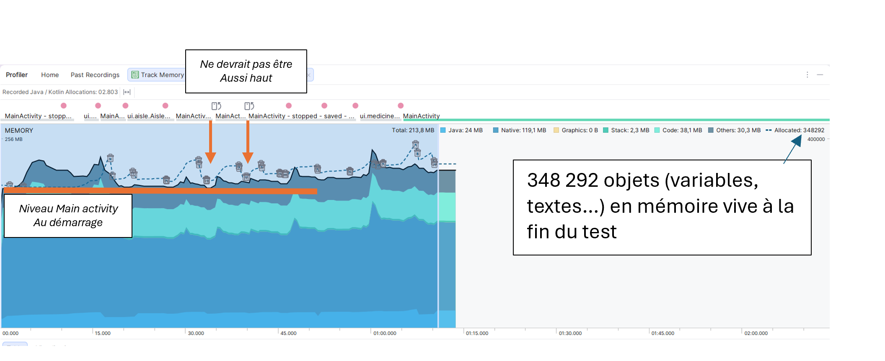
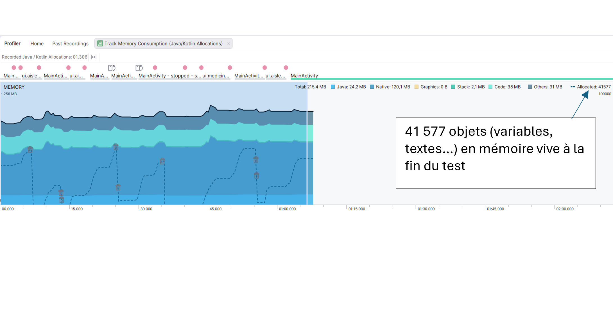
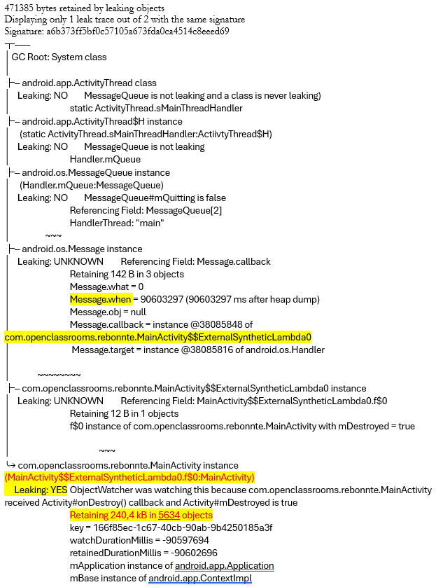
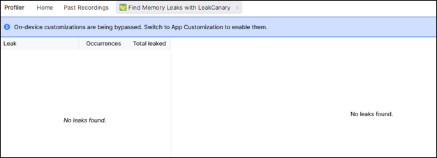
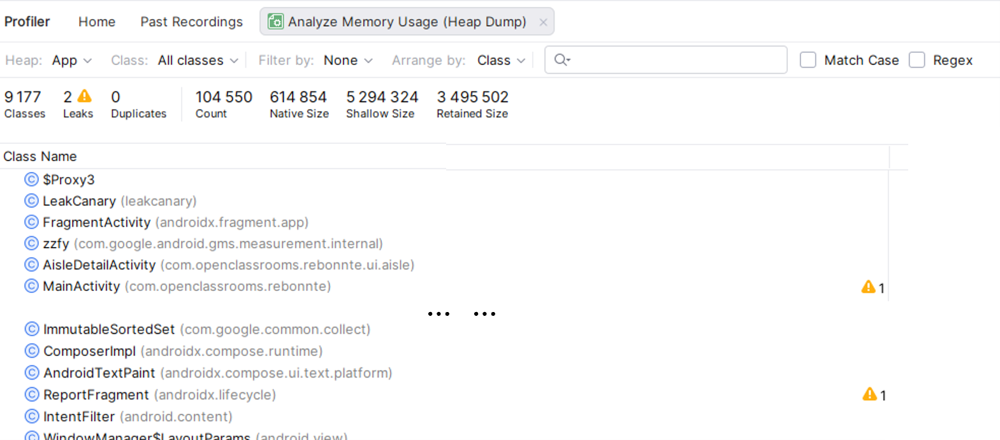
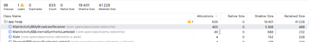
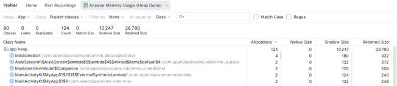

# Mesures Android Profiler

Comparaison avant/après correction des deux fuites mémoire, avec la **même séquence d'utilisation**.

3 outils utilisés :
<figure markdown>

<figcaption>outils utilisés dans Android Profiler</figcaption>
</figure>

Les séquences de test "avant" ont été réalisées sur le code livré : boucle d'enregistrement du `BroadcastReceiver` et référence
statique vers l'`Activity`
Les séquences de test "après" ont été effectuées après T06 et T07 : enregistrement unique du receiver et suppression de la référence statique avec le passage à navigation Compose

---

## Track Memory Consumption

### La séquence jouée

Identique sur les avat et après, pour que la comparaison ait un sens :

1. Ajout d'un rayon
2. Ouverture d'un détail, retour
3. Ouverture d'un détail, retour
4. Bascule d'écran
5. Bascule d'écran
6. Passage à l'onglet médicaments
7. Ajout d'un médicament
8. Ouverture du détail, retour

Les bascules d'écran sont le geste déterminant : chacune détruit et recrée
l'`Activity`, ce qui révèle la référence statique.

### La métrique retenue

Le **nombre d'instances retenues** dans le heap dump, plutôt que la pente du
graphe de consommation. Le graphe reste néamoins utile comme illustration.

### Lecture du graphe de consommation

Ce qui distingue une fuite d'un fonctionnement normal, c'est la forme :

| | Forme | Lecture                                                                                                 |
|---|---|---------------------------------------------------------------------------------------------------------|
| Sain | Dents de scie | La mémoire monte, le garbage collector passe, elle redescend **au même niveau**. Le plancher reste plat |
| Fuite | Escalier | Elle redescend un peu plus haut à chaque fois. **Le plancher grimpe**                                   |

La différence d'échelle entre les deux graphiques rend la comparaison difficile, mais on voit bien sur le graphique final les planchers bas après le garbage.

### Graphiques avant / après

<figure markdown>
  { width="700" }
  <figcaption>Le plancher remonte après chaque passage du garbage collector</figcaption>
</figure>

    Graphe *Track Memory Consumption* sur l'ancien code. Environ 348 000 objets en mémoire vive à la fin du test

<figure markdown>
  { width="700" }
  <figcaption>Le passage du garbage collector est nettement plus marqué</figcaption>
</figure>

    Graphe *Track Memory Consumption* après correction. Environ 41 000 objets en mémoire vive à la fin du test

---
## Détection de fuites : Find Memory Leak

Cet outil permet de vérifier où se trouvent les fuites mémoires, facilitant la recherche dans le code.
Le résutlat indique de chercher la lambda programmée. 
En l'occurence sur notre code : Handler().postDelayed({ startMyBroadcast() }, 200)

<figure markdown>
  
  <figcaption>La tâche avant correction</figcaption>
</figure>

    La tâche indique 5634 objets au moment de la capture

<figure markdown>
  
  <figcaption>La tâche après correction</figcaption>
</figure>

    Résultat de tâche *Find Memory Leaks* après correction: aucune fuite détectée

---
## Usage de la mémoire : Heap Dump

L'analyse initiale montre deux leaks.
<figure markdown>
  { width="700" }
  <figcaption>graph toutes classes confondues</figcaption>
</figure>

Un filtrage des classes métiers et le tri par ordre décroissant des allocations permet de déterminer le composant qui est en anomalie.
<figure markdown>
  { width="700" }
  <figcaption>graph filtré par classe métier : BroadcastReceiver et lambda</figcaption>
</figure>

Le composant MyBroadcastReceiver montre 488 éléments retenus et 405 allocations simultanées. L'activité s'abonne au même évènement en boucle au lieu d'avoir une instance unique.
Les 49 allocations concernant la lambda0, confirme la répétition de la tâche via le handler qui génère la fuite mémoire identifiée à l'analyse Leak Canary.

### Analyse après
<figure markdown>
  { width="700" }
  <figcaption>graph après correction</figcaption>
</figure>

---
## Synthèse

!!! note "À compléter avec vos relevés"

    | Mesure | Avant | Après |
    |---|---|---|
    | Instances de `MainActivity` | | 1 |
    | Instances de `MyBroadcastReceiver` | | |
    | Taille retenue par `MainActivity` | | |
    | Fuites détectées | | 0 |

    Les deux chiffres qui parlent le plus sont le nombre d'instances de
    `MainActivity` — une seule devrait exister à tout instant — et la taille
    retenue.
